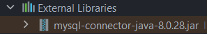

## :triangular_flag_on_post: JDBC (Java Data Base Connectivity)

 <b>Java JDBC (Java Data Base Connectivity) MySQL, Oracle, MS SQL Server gibi veritabanlarına bağlanmak veri çekme, listeleme, ekleme, silme, güncelleme gibi işlemleri yapmak için kullanılan pakettir.</b>

### **5 Adımda JDBC’yi Kullanmak**

1. Veritabanımız ile bağlantı oluşturacağız.
2. JDBC Driver’imizi yükleyeceğiz.
3. Statement/PreparedStatement sorgularımızı oluşturacağız.
4. Resultset oluşturacağız
5. Ve son olarak oluşturduğumuz bağlantıyı/statementi/resulset’i kapatacağız.

### :pushpin: External Libraries (jars)
#### Gerekli olan jar bu şekilde MySql veritabanına bağlanma işlemini gerçekleştiriyoruz.
